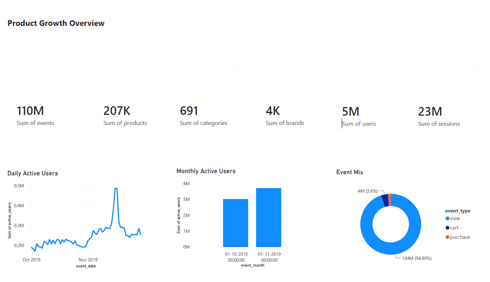
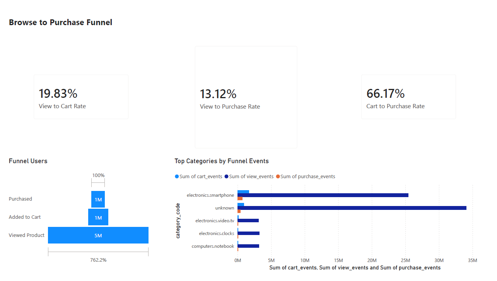
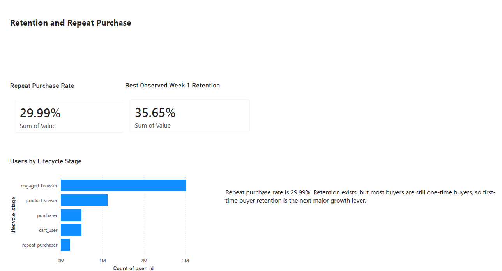
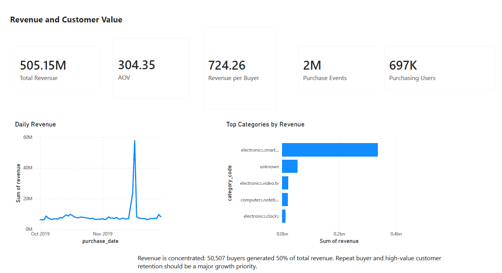

# Product Growth Metrics for an E-commerce Marketplace

## Business Problem

A multi-category e-commerce marketplace needs to understand whether the product is healthy: are users active, do they move from browsing to purchase, do buyers come back, and which behaviors are most connected to customer value?

This project builds a compact Product Analytics framework around the question:

```text
How healthy is the product, and what should the Product team improve next?
```

## Project Focus

This is not a broad sales reporting project. It is a Product Analytics case study focused on:

- DAU, WAU, MAU, and DAU/MAU stickiness
- New vs returning user activity
- View to cart to purchase funnel conversion
- Customer cohorts and repeat purchase retention
- Revenue, AOV, ARPU proxy, and customer value proxy
- Feature adoption using behavioral events
- A/B test design for future product improvements

## Dataset

Source: Kaggle, `mkechinov/ecommerce-behavior-data-from-multi-category-store`

The raw dataset is several gigabytes and is intentionally not committed to GitHub. Download it locally with:

```powershell
python scripts/00_download_dataset.py
```

The transformation pipeline builds a local DuckDB database and compact Power BI marts:

```powershell
python scripts/01_build_transformation_pipeline.py
```

## Key Findings

- The dataset contains 109.95M events, 5.32M users, 23.02M sessions, and 206.88K products across October and November 2019.
- Product usage improved from October to November: average DAU increased from 208.8K to 287.4K, while MAU increased from 3.02M to 3.70M.
- DAU/MAU stickiness improved from 6.91% in October to 7.78% in November, but still suggests mostly occasional marketplace behavior rather than daily habit.
- The largest funnel opportunity is before cart: 19.83% of viewers carted, while 66.17% of cart users purchased.
- Repeat purchase rate was 29.99% among buyers, which shows a meaningful retained buyer segment but also a large one-time buyer base.
- Revenue totaled 505.15M across 1.66M purchase events, with an AOV of 304.35 and revenue per buyer of 724.26.
- Revenue is concentrated: 50,507 buyers generated 50% of total revenue, out of 697,470 total buyers.
- Users who adopted cart behavior had much higher purchase and revenue outcomes than users who only browsed.

## Recommendations

1. Prioritize product discovery and product detail page improvements, because the biggest conversion loss happens before users add items to cart.
2. Build retention programs for first-time buyers, since repeat purchasers are much more valuable than one-time buyers.
3. Improve category and brand attribution quality, because unknown category rows materially limit product and merchandising diagnosis.
4. Use A/B tests for future product changes rather than claiming causal lift from historical behavioral data.

## Notebooks

- [01 Data Exploration](notebooks/01_data_exploration.ipynb)
- [02 Growth Metrics](notebooks/02_growth_metrics.ipynb)
- [03 Funnels](notebooks/03_funnels.ipynb)
- [04 Retention Cohorts](notebooks/04_retention_cohorts.ipynb)
- [05 Revenue and LTV Proxy](notebooks/05_revenue_ltv.ipynb)
- [06 Feature Adoption](notebooks/06_feature_adoption.ipynb)
- [07 Experiment Design](notebooks/07_experiment_design.ipynb)

## SQL

Reusable SQL lives in [sql/analysis](sql/analysis):

- `dau.sql`, `wau.sql`, `mau.sql`
- `funnel.sql`
- `cohorts.sql`, `retention.sql`
- `revenue.sql`
- `feature_adoption.sql`

## Decision Memo

The portfolio-ready product recommendation is in [docs/product_decision_memo.md](docs/product_decision_memo.md).

Supporting documentation:

- [Data Model](docs/data_model.md)
- [Data Quality Summary](docs/data_quality_summary.md)
- [Transformation Validation](docs/transformation_validation.md)
- [Raw Data Dictionary](docs/data_dictionary/raw_event_data_dictionary.md)

## Dashboard Plan

The Power BI dashboard is a focused four-page product metrics dashboard:

- Executive overview
- Funnel performance
- Retention and cohorts
- Revenue and customer value

The Power BI `.pbix` file is kept local and ignored by Git. The exported dashboard PDF is available at [reports/exports/product_growth_dashboard.pdf](reports/exports/product_growth_dashboard.pdf).

### Dashboard Preview









Exported marts are generated locally under `data/processed/powerbi_marts/` and are not committed.

## Project Structure

```text
product-growth-analytics/
  data/
    raw/
    processed/
  docs/
  notebooks/
  scripts/
  sql/
    analysis/
  src/
    product_growth_analytics/
  dashboard/
```

## How To Run

```powershell
pip install -r requirements.txt
python scripts/00_download_dataset.py
python scripts/01_build_transformation_pipeline.py
jupyter lab
```

Run notebooks in numeric order from `01` to `07`.

## Caveats

- Customer lifetime value is a proxy because the dataset covers only two months and does not include margin, acquisition cost, or long-term customer history.
- Feature adoption findings are correlational. They show behavioral associations, not causal effects.
- A November 15 to 17 event-volume anomaly is documented and should be considered when interpreting peaks.
- Unknown category and brand values limit product-level diagnosis.
